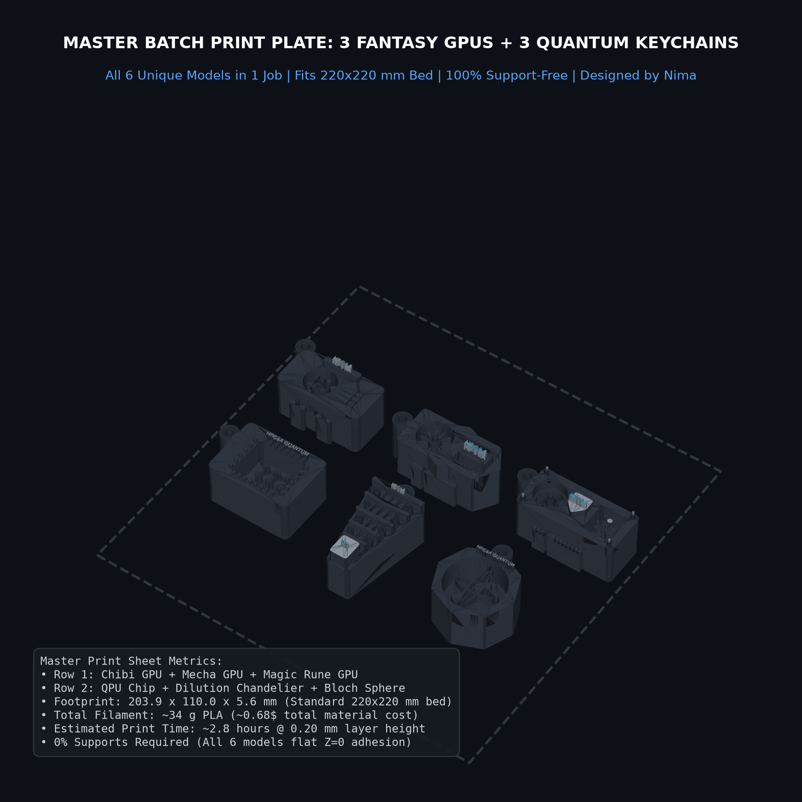
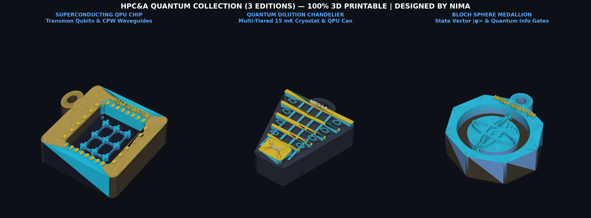
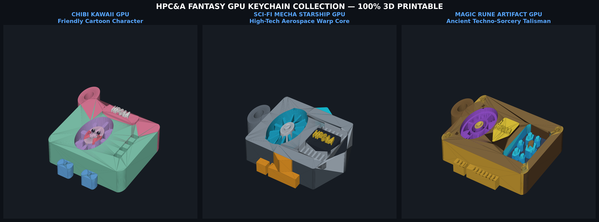
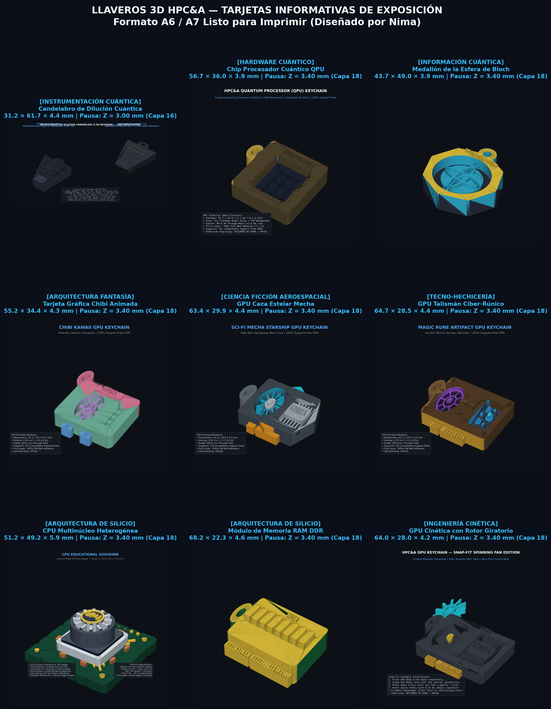
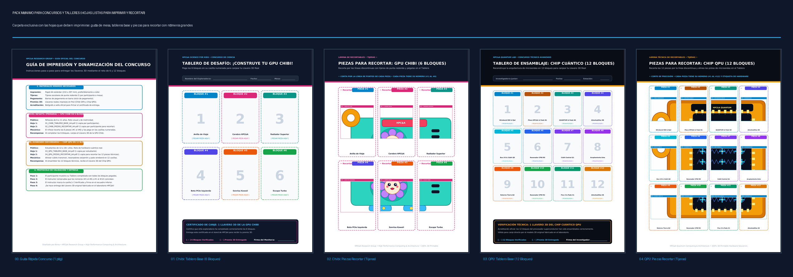

# HPC&A 3D Science & Fantasy Keychains Suite
### 3D-Printable Science Souvenirs for High-Performance Computing & Quantum Information
**Designed by Nima** | Commissioned for the **HPC&A Research Group** (High Performance Computing & Architecture)

[](https://creativecommons.org/licenses/by-nc-sa/4.0/)
[](LICENSE)
[-success.svg)](#slicer--printing-guidelines)
[](#mass-production-batch-plates)

---



A collection of **6 unique, production-grade 3D-printable keychains** blending high-performance computing, quantum hardware, and mechanical fantasy aesthetics. Every model is parametrically engineered from first principles in Python CAD ([Build123d](https://github.com/gumyr/build123d)), 100% watertight, and strictly **0% supports required** on standard FDM 3D printers.

Every keychain features **`DESIGNED BY NIMA`** debossed on the bottom layer ($Z=0$), ensuring clear attribution while resting flat on the print bed.

---

## Ready-to-Print Download Package

The repository includes a pre-packaged [`ready_to_print/`](ready_to_print/) directory containing all 6 models and batch plates in 4 standard 3D file formats:

* **[Download Full Print-Ready ZIP Package (31 MB)](ready_to_print/hpc_a_keychains_print_ready.zip)** — Complete archive with STL, 3MF, STEP, OBJ, and batch plates in 1 click.
* **[`ready_to_print/stl/`](ready_to_print/stl/)** — Universal binary STL files compatible with all slicing software.
* **[`ready_to_print/3mf/`](ready_to_print/3mf/)** — Modern 3D Manufacturing Format files for Bambu Studio, PrusaSlicer, and OrcaSlicer.
* **[`ready_to_print/step/`](ready_to_print/step/)** — AP214 boundary-representation CAD solids for parametric engineering (SolidWorks, Fusion360, FreeCAD).
* **[`ready_to_print/obj/`](ready_to_print/obj/)** — Wavefront OBJ polygon meshes for 3D visualization and CGI rendering.
* **[`ready_to_print/batch_plates/`](ready_to_print/batch_plates/)** — Pre-arranged nested layouts in STL and 3MF for high-throughput batch production.
* **[`ready_to_print/PRINTING_GUIDE.md`](ready_to_print/PRINTING_GUIDE.md)** — Production print manual for workshop operators.

---

## The 6 Editions

### Quantum Computing Hardware Editions


1. **Superconducting QPU Chip (`qpu_keychain_hpca`)**
   - Transmon qubit crosses, serpentine coplanar waveguide (CPW) readout resonators, wirebond gold contact pads, and recessed silicon substrate cavity.
   - Dimensions: $56.7 \times 36.0 \times 3.9\text{ mm}$ | Volume: $4.8\text{ cm}^3$ (~$4.4\text{ g}$ PLA).
   - Formats: [STL](ready_to_print/stl/qpu_keychain_hpca.stl) | [3MF](ready_to_print/3mf/qpu_keychain_hpca.3mf) | [STEP](ready_to_print/step/qpu_keychain_hpca.step) | [OBJ](ready_to_print/obj/qpu_keychain_hpca.obj)

2. **Multi-Tiered Dilution Chandelier (`quantum_chandelier`)**
   - 2.5D tiered silhouette of an ultra-low temperature $15\text{ mK}$ dilution refrigerator cryostat.
   - 5 gold thermal stages, vertical RF coaxial lines, side heat-exchanger cooling loops, and bottom gold-plated QPU shielding can.
   - All text inscriptions maintain verified **$>5.0\text{ mm}$ safety clearances** with zero boundary protrusion.
   - Dimensions: $31.2 \times 61.7 \times 4.4\text{ mm}$ | Volume: $4.2\text{ cm}^3$ (~$3.9\text{ g}$ PLA).
   - Formats: [STL](ready_to_print/stl/quantum_chandelier.stl) | [3MF](ready_to_print/3mf/quantum_chandelier.3mf) | [STEP](ready_to_print/step/quantum_chandelier.step) | [OBJ](ready_to_print/obj/quantum_chandelier.obj)

3. **Bloch Sphere Quantum Info Medallion (`quantum_bloch`)**
   - Octagonal coin frame with a 3D spherical dome representing the single-qubit state space.
   - Features equator ring, prime meridian, $Z$-axis spindle, state vector $|\psi\rangle$ arrow, and basis state labels $|0\rangle$ & $|1\rangle$.
   - Dimensions: $43.7 \times 49.0 \times 3.9\text{ mm}$ | Volume: $3.7\text{ cm}^3$ (~$3.4\text{ g}$ PLA).
   - Formats: [STL](ready_to_print/stl/quantum_bloch.stl) | [3MF](ready_to_print/3mf/quantum_bloch.3mf) | [STEP](ready_to_print/step/quantum_bloch.step) | [OBJ](ready_to_print/obj/quantum_bloch.obj)

---

### Fantasy GPU Editions


1. **Chibi Anime GPU (`gpu_fantasy_chibi`)**
   - Cartoon graphics card with smiling anime face, blush cheeks, petal fan blades, and curved boots.
   - Dimensions: $55.2 \times 34.4 \times 4.3\text{ mm}$ | Volume: $4.3\text{ cm}^3$ (~$4.0\text{ g}$ PLA).
   - Formats: [STL](ready_to_print/stl/gpu_fantasy_chibi.stl) | [3MF](ready_to_print/3mf/gpu_fantasy_chibi.3mf) | [STEP](ready_to_print/step/gpu_fantasy_chibi.step) | [OBJ](ready_to_print/obj/gpu_fantasy_chibi.obj)

2. **Sci-Fi Mecha Starfighter GPU (`gpu_fantasy_mecha`)**
   - Supersonic fighter aesthetic with swept-back aerofoil wings, central supersonic jet turbine, and dual rear thrusters.
   - Dimensions: $63.4 \times 29.9 \times 4.4\text{ mm}$ | Volume: $4.0\text{ cm}^3$ (~$3.7\text{ g}$ PLA).
   - Formats: [STL](ready_to_print/stl/gpu_fantasy_mecha.stl) | [3MF](ready_to_print/3mf/gpu_fantasy_mecha.3mf) | [STEP](ready_to_print/step/gpu_fantasy_mecha.step) | [OBJ](ready_to_print/obj/gpu_fantasy_mecha.obj)

3. **Cyber-Runic Arcane GPU (`gpu_fantasy_rune`)**
   - Alchemical talisman blending electronic PCB traces with an 8-spoke summoning circle, royal shield crest, and mana crystals.
   - Dimensions: $64.7 \times 28.5 \times 4.4\text{ mm}$ | Volume: $4.5\text{ cm}^3$ (~$4.2\text{ g}$ PLA).
   - Formats: [STL](ready_to_print/stl/gpu_fantasy_rune.stl) | [3MF](ready_to_print/3mf/gpu_fantasy_rune.3mf) | [STEP](ready_to_print/step/gpu_fantasy_rune.step) | [OBJ](ready_to_print/obj/gpu_fantasy_rune.obj)

---

## Mass Production Batch Plates

Pre-arranged multi-model print layouts engineered for standard $220 \times 220\text{ mm}$ print beds:

| Plate Name | Contents | Array Footprint | Filament Weight | Print Time @ 0.20 mm |
| :--- | :--- | :--- | :--- | :--- |
| **`batch_master_suite_x6`** | **Complete 6-Pack (All 6 unique models)** | $203.9 \times 110.0 \times 4.4\text{ mm}$ | $\approx 24\text{ g}$ | **~2.0 hours** |
| **`batch_fantasy_gpus_x6`** | 6x Fantasy GPUs (2x Chibi, 2x Mecha, 2x Rune) | $203.9 \times 78.4 \times 4.4\text{ mm}$ | $\approx 24\text{ g}$ | **~2.2 hours** |
| **`batch_quantum_collection_x6`** | 6x Quantum Models (2x QPU, 2x Chandelier, 2x Bloch) | $174.2 \times 129.7 \times 4.4\text{ mm}$ | $\approx 23\text{ g}$ | **~2.2 hours** |

Available in both STL and 3MF formats under [`ready_to_print/batch_plates/`](ready_to_print/batch_plates/).

---

## Slicer & Printing Guidelines

* **Supports:** **STRICTLY DISABLED (0%)** — All overhang angles $\le 45^\circ$, all text debossed/embossed with print-safe angles.
* **Layer Height:** $0.20\text{ mm}$ (First layer: $0.20\text{ mm}$).
* **Infill:** 15% – 20% (Gyroid, Grid, or Adaptive Cubic).
* **Walls / Perimeters:** 3 to 4 loops (guarantees solid $\varnothing 4.6\text{ mm}$ keyring hole strength).
* **Material:** PLA, PLA+, or PETG (Nozzle: 205–215°C, Bed: 60°C).
* **Brim / Raft:** None needed (solid planar bed contact).
* **Dual-Color Printing (Single Extruder):** Set **Pause at Height** (`M600`) universally at **$Z = 3.40\text{ mm}$ (Layer 18 @ 0.20 mm)** for all standard models and batch plates ($Z = 3.00\text{ mm}$ / Layer 16 for standalone Chandelier). See the full model-by-model reference table in [`ready_to_print/PRINTING_GUIDE.md`](ready_to_print/PRINTING_GUIDE.md).

For complete workshop instructions, see [`ready_to_print/PRINTING_GUIDE.md`](ready_to_print/PRINTING_GUIDE.md).

---

## Companion Exhibition Display Cards (A6, A7, A4)

The repository provides high-resolution, print-ready companion cards in Spanish ([`display_cards/`](display_cards/)) designed for tabletop pedestals, conference exhibition booths, and gift boxes. Each card features the scientific/engineering narrative, dimensions, slicer color swap instructions, and author attribution:

* **[`display_cards/cards_a6.pdf`](display_cards/cards_a6.pdf)** — Standalone A6 placards ($105 \times 148\text{ mm}$), 1 card per page in Spanish.
* **[`display_cards/cards_a7.pdf`](display_cards/cards_a7.pdf)** — Compact A7 mini placards ($74 \times 105\text{ mm}$), 1 card per page in Spanish.
* **[`display_cards/print_sheet_a6_on_a4.pdf`](display_cards/print_sheet_a6_on_a4.pdf)** — A4 multi-up print sheets (4x A6 cards/page) with cutting guidelines.
* **[`display_cards/print_sheet_a7_on_a4.pdf`](display_cards/print_sheet_a7_on_a4.pdf)** — A4 multi-up print sheets (8x A7 cards/page) with cutting guidelines.
* **[`display_cards/index.html`](display_cards/index.html)** — Interactive web dashboard with direct browser print (`Ctrl+P`).

<p align="center">
  
</p>


---

## Competition Print Pack (Hojas Listas para Imprimir)

For quick workshop operations, science fairs, and school competitions, the dedicated folder [`concurso_listo_para_imprimir/`](concurso_listo_para_imprimir/) contains **strictly the minimum printable sheets** with **pure 2D vector illustrations (100% mesh-free)** and **extra-large numbers**:



* **[`00_GUIA_DEL_CONCURSO.pdf`](concurso_listo_para_imprimir/00_GUIA_DEL_CONCURSO.pdf)** — 1-Page quick guide for the booth instructor (materials, cutting rules, prize flow).
* **Junior Level (Kids / Primary School — Chibi GPU in 6 Blocks):**
  - **[`01_CHIBI_TABLERO_BASE_A4.pdf`](concurso_listo_para_imprimir/01_CHIBI_TABLERO_BASE_A4.pdf)** — 1 copy per child: Assembly board with large numbers 1 to 6 and official certification.
  - **[`02_CHIBI_PIEZAS_RECORTAR_A4.pdf`](concurso_listo_para_imprimir/02_CHIBI_PIEZAS_RECORTAR_A4.pdf)** — 1 copy per child: Full-color 6-block cut-out sheet with scissor guides (`✂ - - -`).
* **Advanced Level (Teens & Secondary School — Superconducting QPU Chip in 12 Blocks):**
  - **[`03_QPU_TABLERO_BASE_A4.pdf`](concurso_listo_para_imprimir/03_QPU_TABLERO_BASE_A4.pdf)** — 1 copy per student: 12-Slot quantum hardware board with extra-large numbers 1 to 12.
  - **[`04_QPU_PIEZAS_RECORTAR_A4.pdf`](concurso_listo_para_imprimir/04_QPU_PIEZAS_RECORTAR_A4.pdf)** — 1 copy per student: 12-Piece microwave hardware cut-out sheet.

---

## Kids & Students 2D Reward & Activity Suite (Extended)

The extended suite under [`kids_reward_challenge/`](kids_reward_challenge/) also includes scientific passports, stamp cards, coloring sheets, and an interactive HTML web dashboard:

1. **Junior Level (Chibi GPU — 6 Blocks):**
   * [`tablero_puzle_recompensa_a4.pdf`](kids_reward_challenge/tablero_puzle_recompensa_a4.pdf) — 2-Page A4: Board + 6 Cut-out pieces.
   * [`pasaporte_misiones_chibi_a4.pdf`](kids_reward_challenge/pasaporte_misiones_chibi_a4.pdf) — 1-Page A4: 6-Challenge science passport with stamp circles and tear-off claim coupon.
   * [`colorea_tu_gpu_chibi_a4.pdf`](kids_reward_challenge/colorea_tu_gpu_chibi_a4.pdf) — 1-Page A4: Clean 6-zone coloring challenge with color-code guide.
   * [`hoja_combinada_todo_en_uno_a4.pdf`](kids_reward_challenge/hoja_combinada_todo_en_uno_a4.pdf) — 1-Page A4: Single eco-friendly sheet.

2. **Advanced Level (QPU Chip — 12 Blocks):**
   * [`tablero_cuantico_avanzado_12bloques_a4.pdf`](kids_reward_challenge/qpu_advanced_12blocks/tablero_cuantico_avanzado_12bloques_a4.pdf) — 2-Page A4: 12-Slot quantum board + 12 technical cut-out pieces.
   * [`pasaporte_cuantico_avanzado_12retos_a4.pdf`](kids_reward_challenge/qpu_advanced_12blocks/pasaporte_cuantico_avanzado_12retos_a4.pdf) — 1-Page A4: 12-Challenge quantum milestone passport with stamp slots and official prize voucher.
   * [`esquema_circuito_cuantico_12bloques_a4.pdf`](kids_reward_challenge/qpu_advanced_12blocks/esquema_circuito_cuantico_12bloques_a4.pdf) — 1-Page A4: 12-Zone microwave schematic and blueprint tracing.
   * [`hoja_combinada_cuantica_expres_a4.pdf`](kids_reward_challenge/qpu_advanced_12blocks/hoja_combinada_cuantica_expres_a4.pdf) — 1-Page A4: Express 12-block single sheet.

3. **Interactive Web Dashboard:** Open [`kids_reward_challenge/index.html`](kids_reward_challenge/index.html) in any browser to preview sheets, inspect individual blocks, and trigger `@media print` directly.

---

## CAD Generation & Reproducibility

Prerequisites: Python 3.10+ and a virtual environment.

```bash
# Clone the repository
git clone git@github.com:snima/hpca-science-3d-keychains.git
cd hpca-science-3d-keychains

# Create virtual environment and install dependencies
python3 -m venv .venv
source .venv/bin/activate
pip install build123d trimesh matplotlib numpy lxml

# Generate all 3D models (STL + STEP)
python generate_fantasy_gpus.py
python generate_all_quantum.py

# Generate batch production plates
python generate_batch_plates.py

# Build print-ready multi-format release folder (STL, 3MF, STEP, OBJ, ZIP)
python prepare_print_ready_package.py

# Render high-resolution showcases
python render_quantum_and_master.py
```

---

## License & Attribution

This project is released under a dual-licensing model:
* **3D Designs, Models, Batch Plates & Documentation:** Licensed under [Creative Commons Attribution-NonCommercial-ShareAlike 4.0 International (CC BY-NC-SA 4.0)](LICENSE).
  - **Free to share, download, 3D-print, and modify** for personal, educational, research, and non-commercial purposes.
  - **Attribution Required:** Must credit **Nima** and the **HPC&A Research Group**.
  - **Non-Commercial:** No commercial sale of 3D prints or digital assets without prior written authorization.
  - **ShareAlike:** Derivative works must be distributed under the same CC BY-NC-SA 4.0 terms.
* **Software & Python CAD Generation Scripts:** Licensed under the [MIT License](LICENSE).
